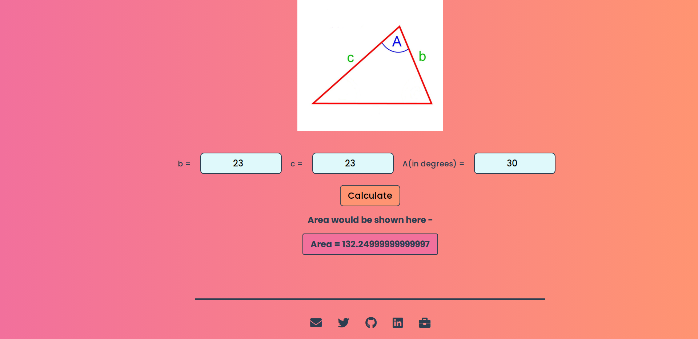
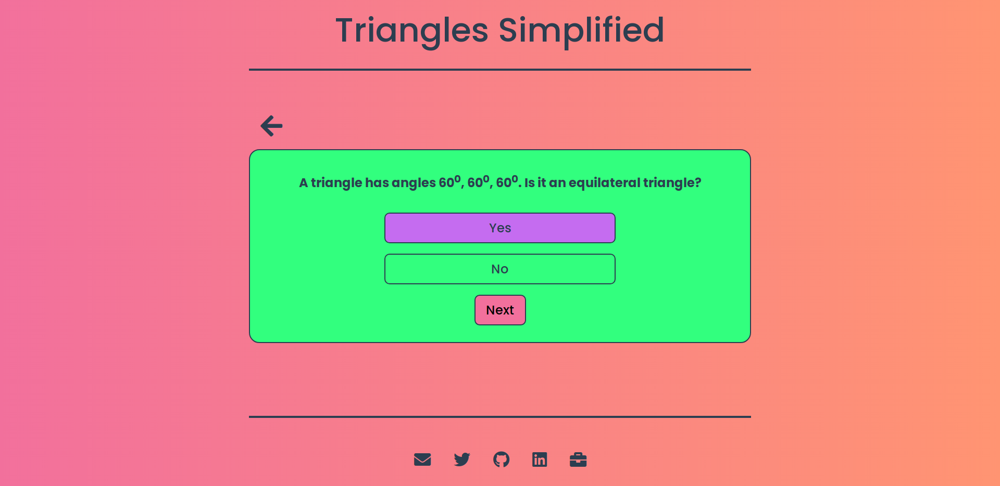

# Triangles Simplified(TS)

Are you fellow student from Mathematics stream ? (Remember the horrors of Triangles & Trigonometry)

Or,

Maybe you want to learn it anyway (you know, to flex around your family/friends) ?

## Introduction

Well whatever the reason might be, [Triangles Simplified](https://simplifytriangles.netlify.app/) can help you in building a very strong grasp over the mathematical concepts of Triangles including their types, their properties, and their basic formulae.

## Description

The app contains 4 sections, which are -

1. Angles of Triangle, where you can give any 3 angles to check if they can form a triangle or not.
   
   _Explore this section to know how value of 3 angles can help you determine if they form a triangle or not._
1. Check Hypotenuse, where you can give the base & altitude of a right-angled triangle to get the hypotenuse of that triangle.
   
   _Use this to practise your Pythagoras' theorem._
1. Calculate Area, where you can get the area of triangle, in different case scenarios. This section has 3 sub-sections -
   

   1. This sub-section will help you in calculating the area of right-angled triangle by just knowing the base & height of the triangle itself.
      
   1. This sub-section will help you in calculating the area of scalene triangle by using lengths of all the sides.
      
      _The formula used here is a very well known one. It's called Heron's Fomula. Try to remember this._
   1. This sub-section will help you in calculating the area of a triangle by just knowing the 2 sides & the angle between them.
      

1. Take a Quiz, which is, well a quiz exercise wherein you can practise whatever concepts you grasped until now. Currently, every question, if answered correctly, will award you with 1 point, with no penalty points for wrong/no answer.
   
   _This is an awesome way to practise your newly acquired skills in triangles. And it's rewarding too._
